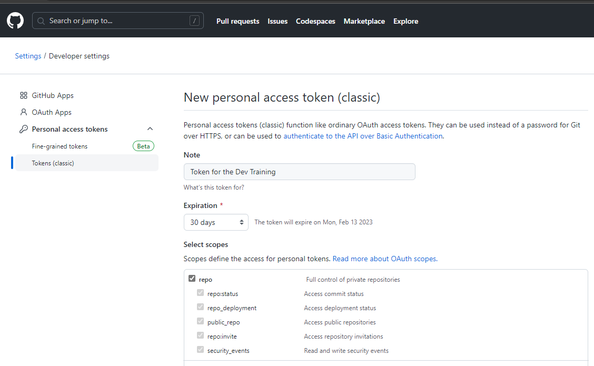

# Getting ready
1. Make sure you have a GitHub account where you can create new repositories on github.com. There is a sign up button to start creating a new acccount if you need to.
1. Choose a free account in that case
1. Check you mail at the end for a confirmation link
1. Complete the verification process

# Tools
There are some tools that you need to be able to participate in the hands-on labs.
You can find more information in the sections below:
1. Have a GitHub account that can create new repos on github.com
1. Install git locally
1. Create a Personal Access Token (PAT) to use for verification (or use an SSH key if you prefer that)

## Install Git
Some excersices will be done locally on your machine. For that you need to install the git client. You can verify if you already have it, by running this command in your favorite shell:
``` 
git --version
```
If you don't have git installed, you can download it from [www.git-scm.com](www.git-scm.com).

## Check access and proxy if needed
Some companies use a proxy before you can go out into the internet. Test if you need to add proxy settings to your setup by trying to clone a public repo with the following command:
```
git clone https://github.com/githubschool/scratch
```
If this works, you do not need a proxy.

### Configure a proxy for git to use
If you do not need authentication for the proxy, you can configure it from the shell using this:

```
git config --global http.proxy https://YOUR.PROXY.SERVER:8080
```
If you do need to authenticate, then configure the proxy as follows:
```
git config --global http.proxy https://PROXY_USERNAME:PROXY_PASSWORD:YOUR.PROXY.SERVER:8080
```

## Personal access token
You can create a personal access token to use with the GitHub authentication by going into GitHub --> Settings --> Developer Settings --> Tokens (classic). Then you can use `Generate new token` to create a new token. Use the `classic token`.

You can also create a token by directly going to this link: [https://github.com/settings/tokens/new](https://github.com/settings/tokens/new).

Select the scope `repo` since we are only going to use this token for reading and writing to the repository and nothing else.

